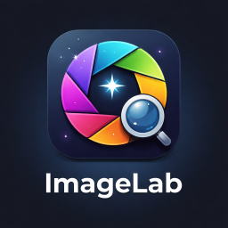

<div align="center">
  
  
  <h1>🖼️ ImageLab</h1>
  <p><strong></strong></p>
  
  <p>
    
    
    
    
  </p>
  
  <p>
    <a href="#features">Features</a> •
    <a href="#installation">Installation</a> •
    <a href="#development">Development</a> •
    <a href="#license">License</a> •   
    <a href="#contributing">Contributing</a> •    
  </p>
</div>

**ImageLab Pro** is a premium, high-performance desktop application designed for professional image manipulation. Built with **.NET 8.0 and WPF**, it offers a sleek, modern UI with a focus on speed, precision, and usability.

---

## ✨ Key Features
<a id="features"></a>

- **🚀 Professional Upscaling:** High-fidelity image enlargement using corrected Lanczos-3 interpolation and linear gamma correction.
- **🛡️ Intelligent Noise Reduction:** Advanced edge-preserving Median Filtering to clean up noisy photos without losing detail.
- **⚖️ Natural Contrast Enhancement:** Sigmoid-based S-curve adjustments for balanced highlights and shadows.
- **✨ Smart Sharpening:** Micro-detail recovery using adaptive thresholding logic.
- **📦 Single EXE Portability:** Zero-dependency standalone executable. Just run and go.
- **🌍 Bilingual Support:** Seamless switching between **English** and **Turkish**.
- **🛠️ Power Tools:**
  - Batch-ready resizing with aspect ratio preservation.
  - High-quality format conversion (PNG, JPG, BMP, ICO).
  - JPG compression with real-time size estimation.

---

## 🎨 Professional UI Design

ImageLab Pro features a **premium glassmorphism aesthetic**:
- Dark-themed, borderless window design.
- Custom title bar with integrated controls.
- Interactive drag-and-drop workspace.
- Real-time image information and metadata viewer.

---

## 🛠️ Technical Stack

- **Core:** .NET 8.0 (Windows Desktop)
- **UI:** WPF (Windows Presentation Foundation) with `WindowChrome`
- **Graphics:** System.Windows.Media.Imaging (Native & Custom Software Rendering Fallback)
- **Optimization:** Parallel Task Processing for high-speed filter application

---

## 🚀 Getting Started
<a id="installation"></a>

### Prerequisites
- Windows 10/11 (x64)
- *.NET 8.0 Runtime is NOT required (Included in the Bundle)*

### Installation
1. Download the latest `ImageLab.exe` from the [Releases](https://github.com/your-username/ImageLab/releases) section.
2. Run the executable. No installation needed.

---

## 🏗️ Development
<a id="development"></a>

To build the project from source:

1. Clone the repository:
   ```bash
   git clone https://github.com/your-username/ImageLab.git
   ```
2. Open the solution in **Visual Studio 2022**.
3. Use the provided build script for a production-ready single EXE:
   ```powershell
   ./build.ps1
   ```

---

## 📜 License
<a id="license"></a>

This project is licensed under the **GNU General Public License v3.0**. See the [LICENSE](LICENSE) file for details.

---

## 🤝 Contributing
<a id="contributing"></a>

Contributions are welcome! Whether it's a bug report, feature request, or a pull request, feel free to get involved.

---

*Developed by **Fatih Durdu** with ❤️ for the open-source community.*
